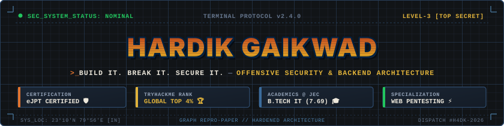
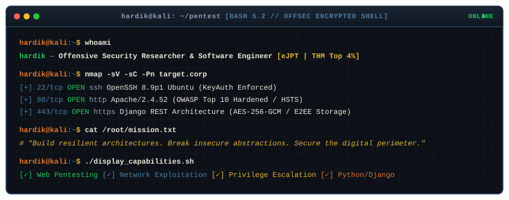
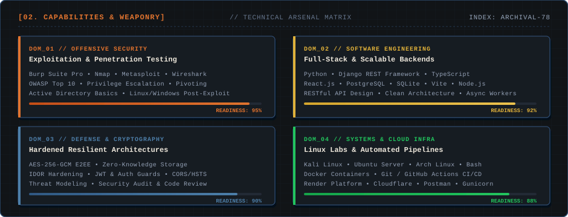

<div align="center">

<!-- Hero Banner (Proportionally Scaled 3D Retro Wordmark & Security Bar) -->


<br />

<!-- Live Portfolio CTA & Status Badges -->
<p align="center">
  <a href="https://hardikgaikwad.vercel.app">
    
  </a>
  <a href="https://www.linkedin.com/in/hardikgaikwad">
    
  </a>
  <a href="mailto:hardikgaikwad04@gmail.com">
    
  </a>
  <a href="https://tryhackme.com/p/hardikgaikwad">
    
  </a>
</p>

</div>

---

### 🖥️ `TERMINAL PROTOCOL // ACTIVE SHELL`

<div align="center">
  
</div>

---

### 🗂️ `CLASSIFIED // OPERATIVE DOSSIER`

```yaml
OPERATIVE_ID    : H4DK-04
DESIGNATION     : Offensive Security Researcher & Full-Stack Developer
CLEARANCE_LEVEL : LEVEL-3 [AUTHORIZED PERSONNEL ONLY]
LOCATION        : 23°10'N 79°56'E [Jabalpur / Bhopal, India]
AFFILIATION     : Jabalpur Engineering College (B.Tech Information Technology, 2023–2027)
ACADEMIC_METRIC : CGPA: 7.69 (Consistent Top Tier) | Class XII: 90.8%
CORE_OBJECTIVE  : "Bridging the gap between vulnerability discovery and resilient backend systems."
```

> [!IMPORTANT]
> **Primary Directive**: Offensive security across the entire kill-chain — reconnaissance, network enumeration, weaponization, privilege escalation, lateral movement, and defensive remediation. Developing hardened, zero-knowledge software architectures resistant to modern exploit vectors.

---

### ⚡ `CAPABILITIES & ARSENAL MATRIX`

<div align="center">
  
</div>

<br />

<details open>
<summary><b>🔍 Expand Detailed Weaponry & Tools Inventory</b></summary>
<br />

| Domain | Tactical Competencies | Primary Tooling & Frameworks |
| :--- | :--- | :--- |
| **Offensive Security** | Web App Pentesting (OWASP Top 10), Network Enumeration, Privilege Escalation (Linux/Windows), Lateral Movement, Pivoting | `Burp Suite Pro`, `Nmap`, `Metasploit`, `Wireshark`, `ffuf`, `Gobuster`, `Hydra`, `Sqlmap` |
| **Backend & Architecture** | RESTful Microservices, Relational Modeling, Zero-Knowledge Storage, Async Task Queues, Clean API Design | `Python`, `Django`, `Django REST Framework`, `TypeScript`, `Node.js`, `PostgreSQL`, `SQLite` |
| **Defensive Engineering** | E2EE Cryptography (AES-256-GCM), IDOR Hardening, Strict Token Authentication, HSTS/CORS Configuration | `JWT / SimpleJWT`, `OpenSSL`, `Cryptography.io`, `Security Middleware`, `OWASP ASVS` |
| **Infrastructure & OS** | Custom Security Labs, Automated Deployment, Containerization, Reverse Proxies | `Kali Linux`, `Ubuntu Server`, `Arch Linux`, `Docker`, `Git`, `GitHub Actions`, `Render` |

</details>

---

### 🔬 `ACTIVE MISSIONS & REPOSITORIES`

<table>
  <tr>
    <td width="50%" valign="top">
      <h4>🛡️ <a href="https://github.com/hardikgaikwad/portfolio-website">Portfolio Terminal System</a></h4>
      <p><i>Full-Stack Cybersecurity Engineer Terminal & Interactive Graph-Paper Portfolio.</i></p>
      <ul>
        <li>Continuous procedural 60fps graph paper canvas with High-DPI noise grain.</li>
        <li>Fully responsive 16-command bash-like interactive terminal emulator.</li>
        <li>Hardened Django REST backend with JWT authentication and anti-FOUC theme engine.</li>
      </ul>
      <p><code>React</code> <code>TypeScript</code> <code>Python</code> <code>Django REST</code> <code>CSS Modules</code></p>
    </td>
    <td width="50%" valign="top">
      <h4>🔍 <a href="https://github.com/hardikgaikwad">SecureMailScope</a></h4>
      <p><i>Automated Email Security Analysis & Network PCAP Forensic Suite.</i></p>
      <ul>
        <li>Deep protocol parsing of raw PCAP/PCAPNG network packets for payload extraction.</li>
        <li>Heuristic detection of spoofed headers, phishing indicators, and malware attachments.</li>
        <li>Containerized backend parser engine with structured forensic JSON output.</li>
      </ul>
      <p><code>Python</code> <code>Network Forensics</code> <code>PCAP Analysis</code> <code>Docker</code></p>
    </td>
  </tr>
  <tr>
    <td width="50%" valign="top">
      <h4>⚔️ <a href="https://github.com/hardikgaikwad">OffDef Suite (Atlas & Beacon)</a></h4>
      <p><i>Unified Offensive-Defensive Security Tooling and Automated Recon Engine.</i></p>
      <ul>
        <li>Distributed network probing, service version fingerprinting, and CVE cross-referencing.</li>
        <li>Automated alert correlation and anomaly detection for defensive monitoring.</li>
        <li>Modular plugin architecture for offensive script execution.</li>
      </ul>
      <p><code>Python</code> <code>Bash</code> <code>Networking</code> <code>Threat Intel</code></p>
    </td>
    <td width="50%" valign="top">
      <h4>🎓 <a href="https://github.com/hardikgaikwad">GetPYQJEC</a></h4>
      <p><i>Distributed High-Availability Academic Exam & Interview Preparation Platform.</i></p>
      <ul>
        <li>Full-stack portal serving university examination archives, syllabi, and technical papers.</li>
        <li>Optimized query latency, zero-downtime database caching, and responsive UI.</li>
        <li>Over thousands of queries resolved per semester for engineering undergraduates.</li>
      </ul>
      <p><code>Python</code> <code>Django</code> <code>PostgreSQL</code> <code>Bootstrap</code> <code>Cloud Storage</code></p>
    </td>
  </tr>
</table>

---

### 🏆 `VERIFIED CREDENTIALS & ACHIEVEMENTS`

```
┌────────────────────────────────────────────────────────────────────────────────────────┐
│ [★] eJPT (eLearnSecurity Junior Penetration Tester) — INE Security (Credential ID)     │
│     Real-world, hands-on multi-network penetration testing, routing, and exploitation. │
│                                                                                        │
│ [★] TryHackMe Global Top 4% Ranking                                                    │
│     Finished Pre-Security, Cyber Security 101, and Jr Penetration Tester career paths. │
│                                                                                        │
│ [★] VulnCon Security Conference — Core Team Member & Media Lead                        │
│     Coordinated technical operations, on-site live infrastructure, and media dispatch. │
└────────────────────────────────────────────────────────────────────────────────────────┘
```

---

### 📡 `ENCRYPTED COMM CHANNELS`

<div align="center">

```
[SEC_DISPATCH_PROTOCOL: READY] ── Connect via the secure channels below:
```

[](https://hardikgaikwad.vercel.app)
[](https://www.linkedin.com/in/hardikgaikwad)
[](https://github.com/hardikgaikwad)
[](https://tryhackme.com/p/hardikgaikwad)
[](mailto:hardikgaikwad04@gmail.com)

<br />

<p align="center">
  <sub>© 2026 Hardik Gaikwad. Printed on Graph Repro-Paper. All Rights Reserved.</sub>
</p>

</div>